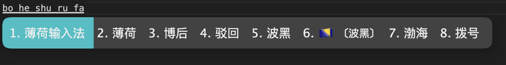
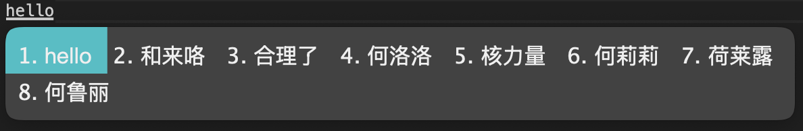
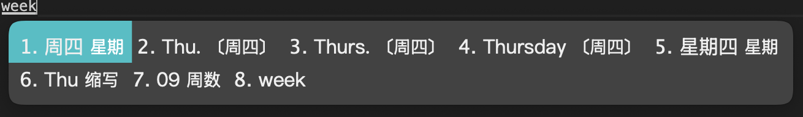
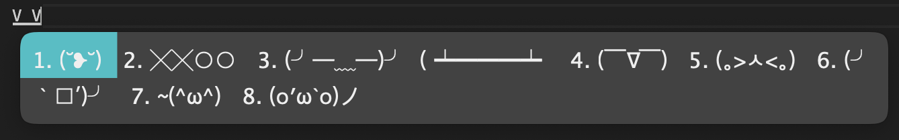
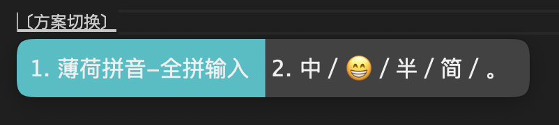

# 我的Rime模板

这是一套快速初始化**Rime**的**模板**。

模板来源于[薄荷输入法](https://github.com/Mintimate/oh-my-rime "跳转GitHub仓库")。  (感谢大佬[Mintimate](https://github.com/Mintimate "跳转原作者GitHub主页")的无私奉献！😘)

因为我平时只使用全拼，所以对原版进行了一定的**删减整改**，只保留了**薄荷输入法**的**全拼部分**。

加入了[万象拼音](https://github.com/amzxyz/RIME-LMDG "跳转GitHub仓库")语言模型，让候选词更**精准可靠**。

加入了[easy-en](https://github.com/BlindingDark/rime-easy-en.git "跳转GitHub仓库")英文词库，对英文输入进行**增强**。

> 注：输入法**起初**可能不太好用，但是**语言模型**会**学习**用户的**用语习惯**，因此会越用越顺手！（理论上 😄）

---

效果展示：

